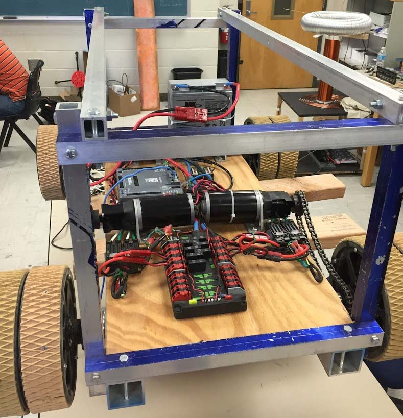

# Quadcopter
</img>
As one of SPARC's personal projects, we are building a fully customizable quadcopter. The initial design was built using a premade kit. Future plans with the quadcopter are to use it for aerial footage and test semi-autonomous/autonomous control.

Changelog
----------
7/5/17 - Quadcopter flew with RC control, however, frame snapped due to structural issues. A new frame has been bought, and APM 2.8 kit is being mounted for autonomous control. Pictures to come
